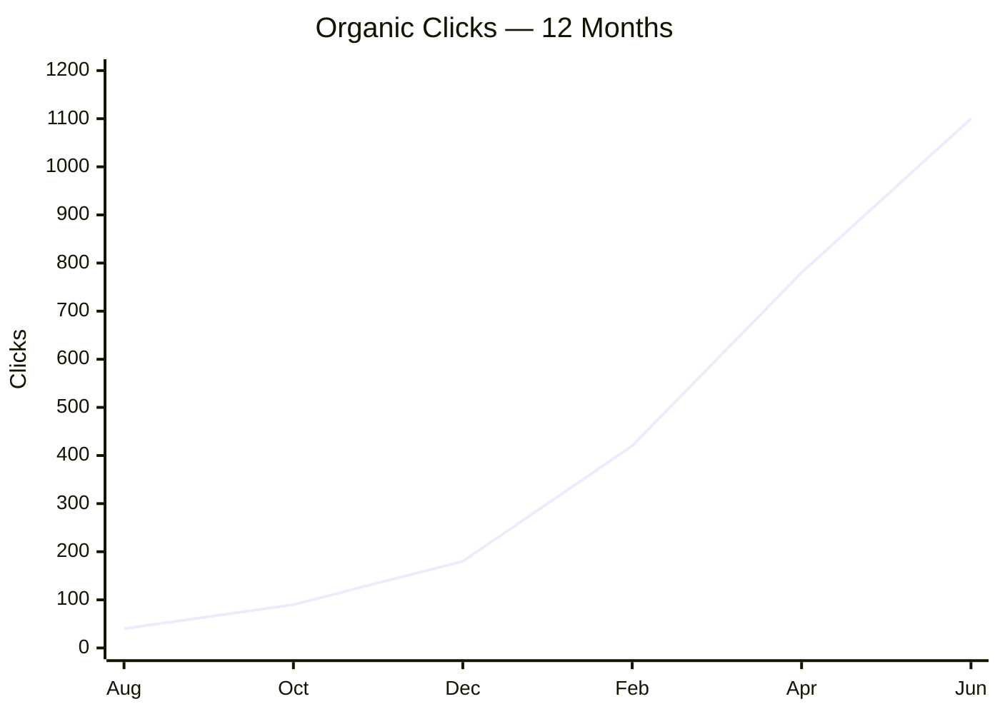

  

<h3 align="center">Hey, I'm Mahidur Rahman</h3>

  

---

  Search changed. People don't just Google anymore — they ask ChatGPT, Perplexity and AI Overviews. 
  Ranking #1 means nothing if the answer engine never cites you.

  <b>SEO</b> so you rank · <b>AEO</b> so you own the answer box · <b>GEO</b> so AI quotes you as the source 
   
  Turning search visibility into <b>traffic, leads and conversions</b>.

## What I Do

### <h3 align="center">SEO — Search Engine Optimization</h3>

| Area | What I Handle |
|---|---|
| **On-Page** | Keyword research · search intent mapping · title & meta optimization · heading structure · image alt text · URL structure · internal linking |
| **Technical** | Crawl & index audits · Core Web Vitals · page speed · mobile-first · XML sitemaps · robots.txt · canonicals · hreflang · JS rendering · site migrations |
| **Off-Page** | Link building · outreach & digital PR · backlink audits · toxic link disavow · competitor gap analysis · brand mention reclamation |
| **Local** | Google Business Profile · local citations · NAP consistency · review strategy · local landing pages · map pack optimization |
| **Content** | Content audits · topic clusters · pillar pages · content briefs · refresh strategy · cannibalization fixes |
| **Reporting** | GSC & GA4 setup · Rank & SERP position tracking · Traffic Tracking · competitor benchmarking · monthly performance reports · traffic-to-conversion attribution |

### <h3 align="center">AEO — Answer Engine Optimization</h3>

| Area | What I Handle |
|---|---|
| **Structured Data** | JSON-LD implementation · FAQPage · HowTo · Article · Product · LocalBusiness · Organization · Breadcrumb · Review · rich result validation |
| **SERP Features** | Featured snippet targeting · paragraph, list & table snippets · People Also Ask coverage · knowledge panel · sitelinks |
| **Content Structure** | Answer-first writing · direct answers in the first 50 words · question-form headings · definition blocks · comparison tables |
| **Entities** | Entity markup · knowledge graph alignment · Wikidata consistency · author & organization E-E-A-T signals |
| **Voice** | Conversational query targeting · long-tail question keywords · local voice intent |

### <h3 align="center">GEO — Generative Engine Optimization</h3>

| Area | What I Handle |
|---|---|
| **AI Crawler Access** | `llms.txt` implementation · GPTBot, PerplexityBot, ClaudeBot & Google-Extended rules · robots.txt strategy for AI agents |
| **Retrieval** | Content chunking for RAG · semantic clarity · self-contained sections · extractable formatting · clean HTML structure |
| **Citation Tracking** | Brand mentions in ChatGPT, Perplexity, Gemini & AI Overviews · citation share vs competitors · prompt-based visibility testing |
| **Citation-Worthy Content** | Original data & statistics · quotable claims · clear definitions · primary-source positioning · freshness signals |
| **Brand Consistency** | Uniform entity descriptions across the web · third-party mention alignment · review & directory consistency |
---

## <h2 align="center">Tools I Use</h2>

<b>SEO & Analytics</b>

<b>AEO / GEO</b>

<b>Web & CMS</b>

<h2 align="center">Results Will look like this</h2>

<h2 align="center">Quote I Work By</h2>

  <i>"Google only loves you when everyone else loves you first."</i> 
  — Wendy Piersall

---

